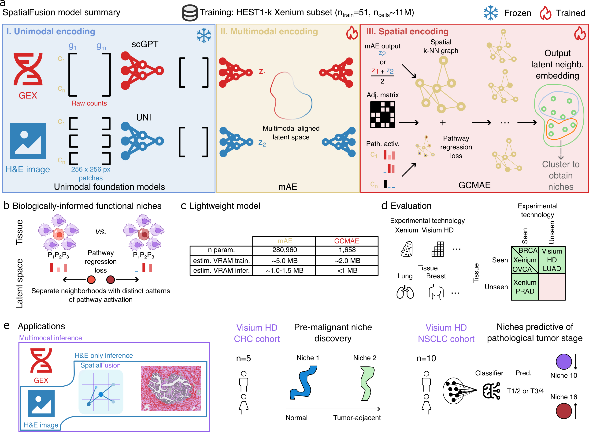

# SpatialFusion

<figure markdown>
  
  <figcaption>
    Overview of the SpatialFusion framework.
  </figcaption>
</figure>

This method is described in the paper (TBD).

**SpatialFusion** is a lightweight foundation model designed to represent find niches in tissue using a lower dimensional embedding. It integrates spatial transcriptomics data with histopathology-derived image features into a shared latent representation, and can be applied to paired spatial transcriptomics and whole slide images or whole slide images only.

This documentation covers:
- Installation instructions
- A quick start guide
- Conceptual background
- Tutorials and examples
- API reference

Source code:
https://github.com/uhlerlab/spatialfusion
